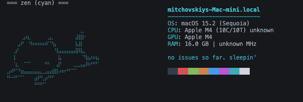
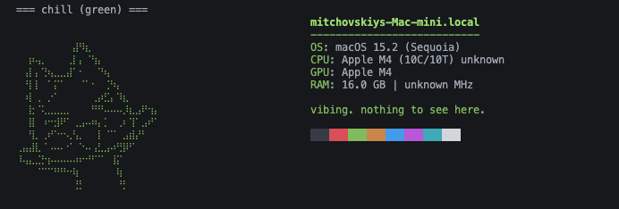
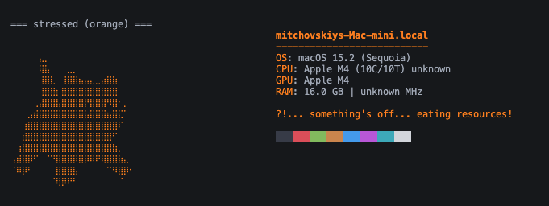
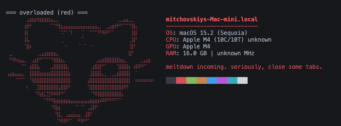

# nyafetch

A tiny, hackable [neofetch](https://github.com/dylanaraps/neofetch)-style
system info tool, written in Python — with a twist: instead of a static logo,
it defaults to a **reactive ASCII cat mascot** whose mood and color reflect
your machine's *actual* CPU/memory/disk load right now.

| zen (cyan) | chill (green) | stressed (orange) | overloaded (red) |
| :---: | :---: | :---: | :---: |
|  |  |  |  |

Four moods, picked from the worst of the three metrics: `zen` (< 40% load),
`chill` (< 70%), `stressed` (< 92%), `overloaded` (>= 92%). Prefer something
more traditional? Pass `--classic` for a plain per-OS box logo instead.

## Install

```bash
git clone https://github.com/AelasarHD/nyafetch.git
cd nyafetch
python -m venv .venv
source .venv/bin/activate  # .venv\Scripts\activate on Windows
pip install -e .
```

Or grab a built wheel from the [Releases](https://github.com/AelasarHD/nyafetch/releases) page:

```bash
pip install nyafetch-*.whl
```

Requires Python 3.11+ (uses the standard library `tomllib`). The only
runtime dependency is [`psutil`](https://github.com/giampaolo/psutil).

## Usage

```bash
nyafetch
# or, without installing the console script:
python -m nyafetch
```

Flags:

| Flag             | Effect                                              |
| ----------------- | ---------------------------------------------------- |
| `--no-color`      | Disable ANSI colors                                   |
| `--color NAME`    | Override the accent color (red/green/yellow/blue/magenta/cyan/white/orange) |
| `--classic`       | Show the plain per-OS box logo instead of the mood mascot |
| `--ascii PATH`    | Use a custom ASCII art `.txt` file instead (overrides both) |

## Configuration

On first run there's no config file; create one at:

- macOS: `~/Library/Application Support/nyafetch/config.toml`
- Linux: `~/.config/nyafetch/config.toml`
- Windows: `%APPDATA%\nyafetch\config.toml`

```toml
fields = ["os", "host", "cpu", "gpu", "ram", "disk"]
accent_color = "magenta"
no_color = false
classic = false
ascii_art = "/path/to/your/logo.txt"
```

Available `fields`: `os`, `host`, `kernel`, `uptime`, `shell`, `terminal`,
`cpu`, `gpu`, `ram`, `disk`, `python`.

## What it shows

```
OS: macOS 15.2 (Sequoia)
Host: mitchovskiys-Mac-mini.local
CPU: Apple M4 (10C/10T) 4.4 GHz
GPU: Apple M4
RAM: 16.0 GB | unknown MHz
Disk: 10.4 GiB / 228.3 GiB (19%)
```

- **OS**: on macOS, includes the release codename (Sequoia, Sonoma, Ventura, ...
  all the way back to Tiger); Windows/Linux version strings are descriptive
  enough on their own.
- **CPU**: brand string plus physical/logical core count and max frequency.
- **GPU**: `system_profiler` on macOS, `lspci` on Linux, `wmic` on Windows.
- **RAM**: total capacity and speed (speed detection is best-effort — some
  platforms/permissions won't expose it, in which case it prints `unknown`).

## Supported platforms

Runs on macOS, Linux, and Windows.

## Development

```bash
pip install -r requirements-dev.txt
pytest
```

Tests cover `render` (ASCII + info layout, color handling), `mood` (load
thresholds), and `config` (load/save/roundtrip) — the pure-logic parts that
don't touch the OS.

## Project layout

```
nyafetch/
  ascii_art.py           # classic per-OS box-art logos + accent colors (--classic)
  mood.py                 # the reactive cat mascot: load -> mood -> face/caption/color
  render.py              # combines logo + info into the printable block
  config.py              # TOML config load/save
  cli.py                 # argparse entry point
  collectors/
    base.py               # InfoSnapshot dataclass
    common.py             # cross-platform helpers (psutil-based)
    macos.py / linux.py / windows.py
tests/
```

## License

MIT — see [LICENSE](LICENSE).
